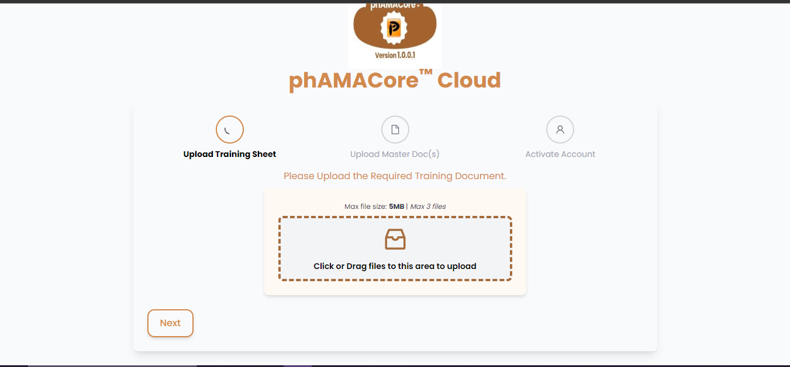
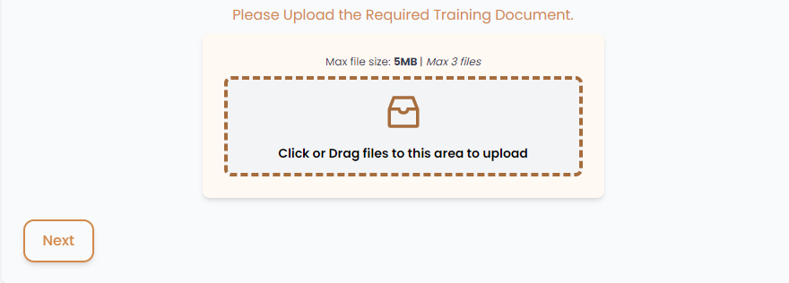
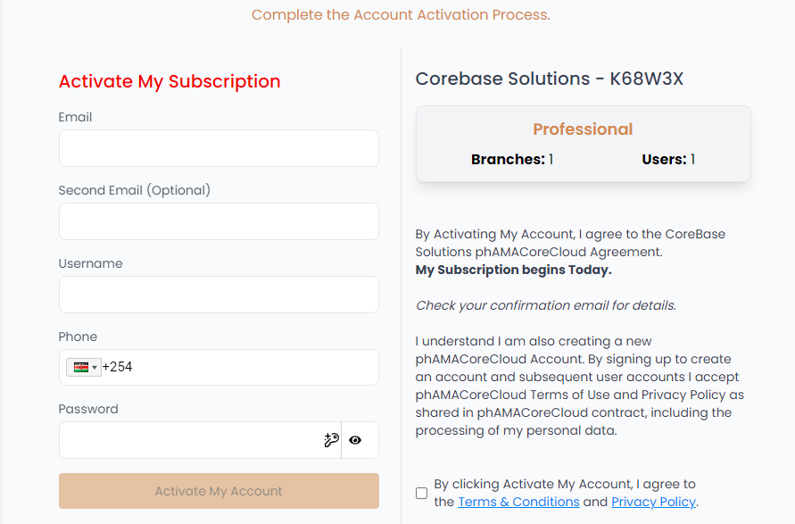

# phAMACore™ Cloud

**phAMACore™ Cloud** is a modern, interactive web application for managing multi-step processes, such as document uploads and account activation, in a user-friendly interface. This project leverages React, Ant Design icons, and Toastify for a smooth and visually appealing experience.

---

## Features

- **Step-by-Step Navigation**: A guided flow with clear instructions for each step.
- **File Upload**: Separate components for uploading training and master documents.
- **Account Activation**: Complete the process with ease using subscription forms.
- **Dynamic UI Updates**: Real-time progress tracking and navigation between steps.
- **Toast Notifications**: Alerts for success, errors, or important messages.

---

## Demo

Below are Screenshots of the app's interface at various steps:

### 1. Welcome Page
The homepage greets the user with the app logo and title.  


### 2. Step Indicator
The stepper shows the current progress and allows navigation between steps.  


### 3. Upload Training Sheet
Users can upload the required training documents.  


### 4. Account Activation
Complete the final step to activate the account.  


## Tech Stack

- **React**: A JavaScript library for building user interfaces.
- **React Router**: For handling in-app routing and navigation.
- **React Hook Form**: A library for managing form state and validation in React.
- **Zod**: A TypeScript-first schema declaration and validation library.
- **Axios**: A promise-based HTTP client for making API requests.
- **React Toastify**: For displaying toast notifications.
- **Ant Design Icons**: Pre-designed icons for a professional look.
- **Tailwind CSS**: For styling the application.
- **Vite**: A fast build tool and development server.

## Installation

### Prerequisites

- Node.js (v14 or above)
- npm (v6 or above) or yarn

1. **Clone the repository:**
   ```bash
   git clone https://github.com/jaywes222/Phamacore_Cloud.git
   cd Phamacore_Cloud

2. **Install Dependencies:**
   ```bash
   npm install

3. **Running the App:**
   ```bash
   npm run dev

4. **Build the project for production:**
   ```bash
   npm run build

## Project Structure

src/
├── assets/                     # Static assets like images and logos
│   └── phamacoreLogo.PNG
├── components/
│   ├── Stepper/                # Stepper components
│   │   ├── StepContent.js
│   │   ├── StepIndicator.js
│   │   └── StepNavigation.js
│   ├── Subscription/           # Subscription form
│   │   └── SubscriptionForm.js
│   └── Upload/                 # Upload form
│       └── UploadForm.js
├── App.css                     # Styles
├── App.js                      # Root component
└── index.js                    # Entry point


## Acknowledgements
- React Hook Form for making form management easy.
- Zod for robust and type-safe schema validation.
- Axios for seamless HTTP requests.
- React Toastify for smooth notification management.
- Tailwind CSS for rapid and modern styling.


